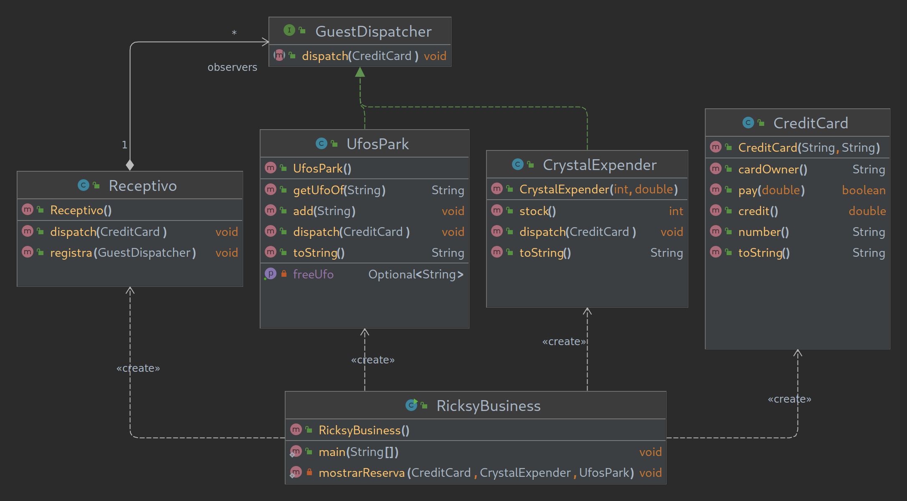

# Ricksy Business

## IV. Examen Programación DAW Dual
Rick celebra una fiesta, y quiere registrar mediante una tarjeta de credito los invitados para así cobrarle servicios aparte.  
Crea el programa con la ayuda del diagrama UML.  

Rick is throwing a party, and he wants to register using a credit card the guests, so he can charge the optional services.  
Create the program with the help of the UML diagram.  

## Key-Concepts :dart: 
- Observer Pattern
- Has-A
- Weak Aggregation

## UML
